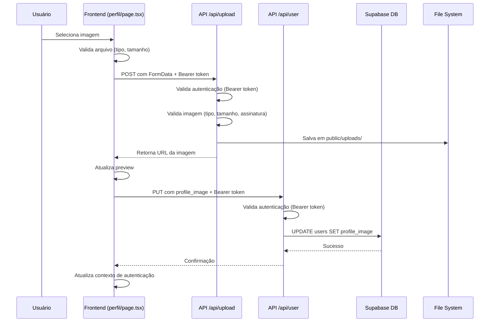

# Correções de Upload de Imagem e Validação da Aplicação

## 📋 Resumo das Correções

Este documento descreve as correções implementadas para resolver os problemas de upload de imagem e validação da aplicação.

## 🐛 Problemas Identificados

### 1. Erro 401 (Não autorizado) no endpoint `/api/user`

**Problema:** O endpoint `/api/user` retornava erro 401 ao tentar salvar a imagem no banco de dados.

**Causa Raiz:**
- A autenticação estava tentando usar cookies de sessão primeiro
- O token Bearer enviado no header não estava sendo priorizado
- A lógica de fallback não estava funcionando corretamente

**Solução:**
- Invertida a ordem de autenticação: **Bearer token primeiro**, depois cookies
- Melhorada a lógica de fallback entre os dois métodos
- Adicionados logs detalhados para debug

**Arquivos modificados:**
- `/app/api/user/route.ts` (métodos GET e PUT)

### 2. Erro 404 ao carregar imagem uploadada

**Problema:** Após o upload bem-sucedido, a imagem retornava 404 ao ser acessada.

**Causa Raiz:**
- O Next.js em modo de desenvolvimento/produção não estava servindo corretamente os arquivos da pasta `/public/uploads/`
- Faltava um endpoint de API para servir as imagens

**Solução:**
- Criado endpoint `/api/uploads/[filename]/route.ts` para servir imagens
- O endpoint:
  - Valida o nome do arquivo (previne path traversal)
  - Retorna a imagem com headers apropriados
  - Implementa cache para melhor performance
  - Retorna erro 404 se a imagem não existir

**Arquivos criados:**
- `/app/api/uploads/[filename]/route.ts`

### 3. Inconsistência nos nomes de campos

**Problema:** Mistura de camelCase e snake_case entre frontend e backend.

**Nota:** O código já estava tratando corretamente a conversão:
- Frontend usa `profileImage` (camelCase)
- Backend salva como `profile_image` (snake_case)
- A conversão acontece em `perfil/page.tsx` na função `saveToDatabase()`

## ✅ Correções Implementadas

### 1. Autenticação Melhorada no `/api/user`

```typescript
// Agora prioriza Bearer token sobre cookies
let authenticatedUser = null;
let authError = null;

// Primeiro: tentar Bearer token
const authHeader = request.headers.get('authorization');
if (authHeader) {
  const token = authHeader.replace('Bearer ', '');
  const { data: { user: tokenUser }, error: tokenError } = 
    await supabase.auth.getUser(token);
  if (!tokenError && tokenUser) {
    authenticatedUser = tokenUser;
  }
}

// Segundo: fallback para cookies
if (!authenticatedUser) {
  const { data: { user }, error: sessionError } = 
    await supabase.auth.getUser();
  if (!sessionError && user) {
    authenticatedUser = user;
  }
}
```

### 2. Endpoint para Servir Imagens

```typescript
// GET /api/uploads/[filename]
export async function GET(request, { params }) {
  const filename = params.filename;
  
  // Validação de segurança
  if (filename.includes("..") || filename.includes("/")) {
    return NextResponse.json(
      { error: "Nome de arquivo inválido" },
      { status: 400 }
    );
  }
  
  // Ler e retornar a imagem
  const filePath = join(process.cwd(), "public", "uploads", filename);
  const fileBuffer = await readFile(filePath);
  
  return new NextResponse(fileBuffer, {
    headers: {
      "Content-Type": "image/jpeg", // ou outro tipo
      "Cache-Control": "public, max-age=31536000, immutable",
    },
  });
}
```

### 3. Script de Validação Completo

Criado script `test-application-validation.js` que valida:
- ✅ Variáveis de ambiente
- ✅ Conexão com Supabase
- ✅ Estrutura de arquivos e diretórios
- ✅ Diretório de uploads e permissões
- ✅ Configuração do Next.js
- ✅ Contexto de autenticação
- ✅ Endpoints de API

**Como executar:**
```bash
node test-application-validation.js
```

## 📁 Arquivos Modificados

### Modificados:
1. `/app/api/user/route.ts`
   - Melhorada autenticação (Bearer token prioritário)
   - Adicionados logs detalhados

### Criados:
1. `/app/api/uploads/[filename]/route.ts`
   - Endpoint para servir imagens uploadadas
   - Validação de segurança
   - Headers de cache

2. `/workspace/test-application-validation.js`
   - Script completo de validação da aplicação
   - Relatório detalhado de todos os componentes

3. `/workspace/CORRECOES_UPLOAD_IMAGEM.md` (este arquivo)
   - Documentação completa das correções

## 🔍 Como Testar

### 1. Executar a Validação
```bash
node test-application-validation.js
```

### 2. Testar Upload de Imagem

1. Inicie a aplicação:
   ```bash
   npm run dev
   ```

2. Faça login na aplicação

3. Vá para a página de perfil (`/perfil`)

4. Clique na imagem de perfil para fazer upload

5. Selecione uma imagem (JPG, PNG, GIF ou WebP, máx 5MB)

6. A imagem deve:
   - Ser enviada com sucesso
   - Aparecer imediatamente no perfil
   - Ser salva no banco de dados
   - Persistir após refresh da página

### 3. Verificar no Console do Navegador

Você deve ver logs como:
```
📸 Iniciando upload da imagem: foto.jpg
👤 Enviando userId: 72c10c5b-6d6c-4823-a7ea-0f8078d9b35b
🔑 Token de autorização enviado: eyJhbGciOiJIUzI1Ni...
✅ Upload da imagem bem-sucedido: /uploads/profile-...-123456789.jpg
💾 Salvando imagem no banco de dados...
✅ Imagem salva no banco de dados com sucesso
🔄 Atualizando contexto de autenticação...
✅ Contexto atualizado com sucesso
```

### 4. Verificar no Console do Servidor

Você deve ver logs como:
```
🔐 Verificando autenticação para PUT /api/user...
🔑 Tentando autenticar via Bearer token...
✅ Usuário autenticado via token: 72c10c5b-6d6c-4823-a7ea-0f8078d9b35b
📝 Dados para atualização: { profile_image: '/uploads/...', updated_at: '...' }
✅ Usuário atualizado com sucesso
```

## 🛡️ Segurança

### Validações Implementadas:
1. **Autenticação obrigatória** para upload
2. **Validação de tipo de arquivo** (apenas imagens)
3. **Limite de tamanho** (5MB)
4. **Validação de assinatura** do arquivo (magic bytes)
5. **Proteção contra path traversal** no endpoint de imagens
6. **Sanitização do userId** no nome do arquivo

## ⚙️ Configurações Necessárias

### Variáveis de Ambiente
Certifique-se de ter um arquivo `.env.local` com:
```env
NEXT_PUBLIC_SUPABASE_URL=sua-url-do-supabase
NEXT_PUBLIC_SUPABASE_ANON_KEY=sua-chave-anonima
```

### Permissões de Diretório
```bash
# Garantir que o diretório de uploads tenha permissões de escrita
chmod 755 public/uploads
```

## 🎯 Fluxo Completo de Upload



## 📝 Notas Adicionais

1. **Supabase Storage:** O código tem fallback para usar o file system local se o Supabase Storage não estiver configurado

2. **Otimização de Imagens:** Desativada no Next.js (`unoptimized: true`) para evitar problemas com imagens dinâmicas

3. **Cache:** As imagens servidas pelo endpoint `/api/uploads/[filename]` têm cache de 1 ano

4. **Logs:** Mantidos logs detalhados para facilitar debugging em produção

## 🚀 Melhorias Futuras Sugeridas

1. **Redimensionamento de Imagens:** Adicionar redimensionamento automático para avatares (ex: 200x200px)

2. **Compressão:** Implementar compressão de imagens no upload

3. **CDN:** Usar CDN para servir as imagens (Cloudflare, AWS CloudFront, etc.)

4. **Limpeza Automática:** Script para remover imagens antigas não utilizadas

5. **Supabase Storage:** Migrar completamente para Supabase Storage em produção

6. **Testes Automatizados:** Adicionar testes E2E para o fluxo de upload

## 📞 Suporte

Em caso de problemas:

1. Execute o script de validação:
   ```bash
   node test-application-validation.js
   ```

2. Verifique os logs no console do navegador (F12)

3. Verifique os logs no terminal do servidor

4. Verifique se as variáveis de ambiente estão configuradas corretamente

5. Verifique as permissões do diretório `/public/uploads/`

---

**Última atualização:** 2025-10-30
**Autor:** Cursor AI Agent
